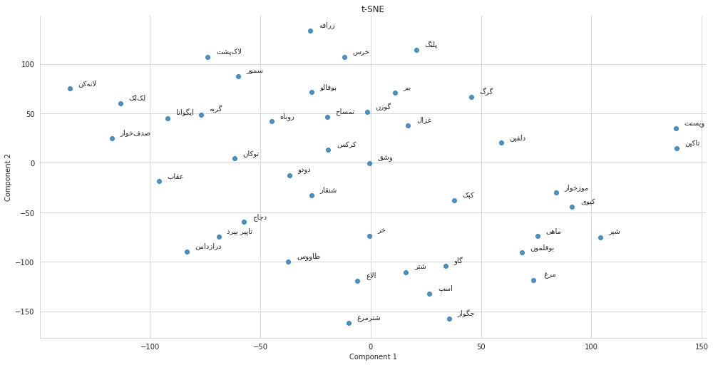

# Persian Word Vectors

A set of pre-trained word embeddings for Persian Language.

| Corpus              | Model               | URL                                                                |
|---------------------|---------------------|--------------------------------------------------------------------|
| [OSCAR](https://traces1.inria.fr/oscar/) - Persian Dedup | FastText - SkipGram | [GDrive](https://drive.google.com/open?id=1wPnMG9_GNUVdSgbznQziQc5nMWI3QKNz) |
| [OSCAR](https://traces1.inria.fr/oscar/) - Persian Dedup | FastText - CBOW     | [GDrive](https://drive.google.com/open?id=1cQP10CGV6kAwmRuESJ5RTsgHq5TveXwV) |
| [OSCAR](https://traces1.inria.fr/oscar/) - Persian Dedup | GloVe     | [GDrive](https://drive.google.com/open?id=1yFCCuA-JrNIrRZWe4ohcJNNWiK5x0Ax9) |


## Example

[](https://colab.research.google.com/github/taesiri/PersianWordVectors/blob/master/FastText-Sample.ipynb)

```python
import fasttext.util
# loading the Model
model_skipgram = fasttext.load_model('farsi-dedup-skipgram.bin')
# Getting Nearest Words
model_skipgram.get_nearest_neighbors('سگ', 15)
```

```python
[(0.782295823097229, 'روتوایلر'),
 (0.7789124250411987, 'توله'),
 (0.7602617144584656, 'شیتزو'),
 (0.758849024772644, 'گربه'),
 (0.7493144273757935, 'بولداگ'),
 (0.7487086653709412, 'پامرانیان'),
 (0.7453492283821106, 'چاوچاو'),
 (0.7400702834129333, 'تریر'),
 (0.7363772988319397, 'پامرانیا'),
 (0.7327418923377991, 'رتوایلر'),
 (0.7243485450744629, 'پاگ'),
 (0.7216327786445618, 'روتوایلر،'),
 (0.721341609954834, '_سگ'),
 (0.719440758228302, 'ایگوانا'),
 (0.7192081212997437, 'سگسگ'),
 (0.7191919088363647, '،سگ'),
 (0.7173099517822266, 'سگ،'),
 (0.7163112163543701, 'شپهرد'),
 (0.7139168977737427, 'سگ,سگ'),
 (0.7111517786979675, 'گربهء'),
 (0.7074176073074341, 'سگ\u200cهای'),
 (0.7066739201545715, '.سگ'),
 (0.7048391699790955, 'دوبرمن'),
 (0.7031064033508301, 'روتوایلر...'),
 (0.7029660940170288, 'قدرجونی'),
 (0.7003535628318787, 'گربها'),
 (0.6981762051582336, 'نگهبانسگهای'),
 (0.696491003036499, 'سگ,گربه'),
 (0.696193277835846, 'دالمیشن'),
 (0.694010853767395, 'راتوایلر')]
```

### t-SNE visualization of Animals


